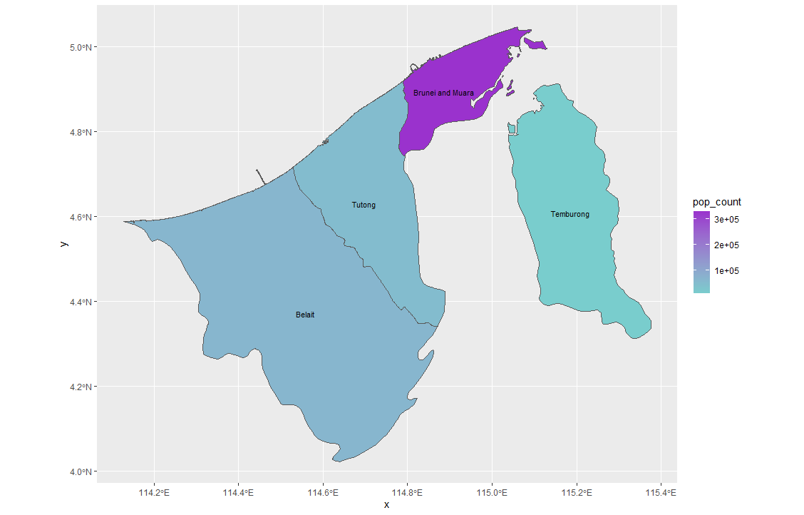
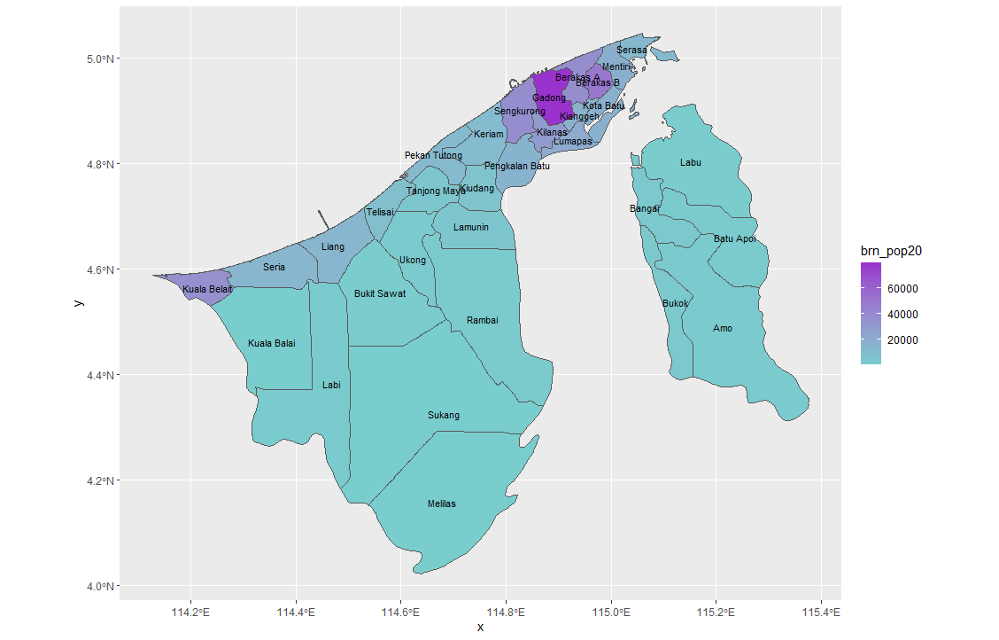
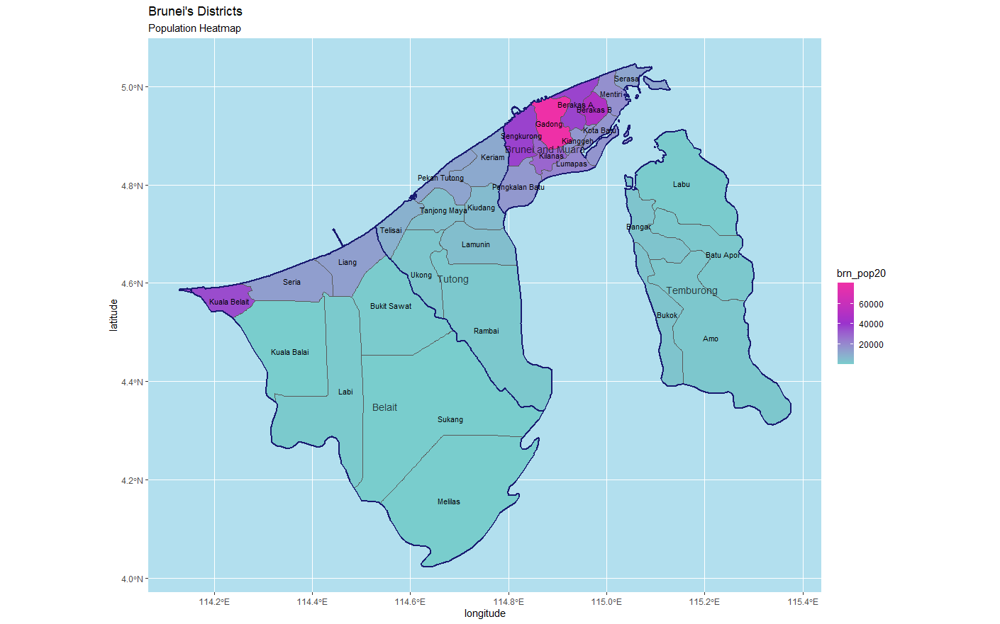

# Extracting Populations from a Raster and Aggregating to Each Unit

For this assignment, I used my ggplot() of Brunei-Darussalam in conjunction with raster data from WorldPop to create a population heat-map. By matching concentrations of color to certain areas of the political map, I made it possible to easily identify the population density of each of the country's four administrative counties. From this map, it is evident that the highest concentration of Brunei's population is settled in Brunei-Muara, which contains the country's capital, while the least are settled on the island county of Temburong. 

 

## Stretch Goal 1

This stretch goal involved plotting counts of population density across a country's secondary admninistrative boundaries. From this evident, the exact distribution of Brunei's small population of roughly 400,000 is more clearly portrayed. Once again, the northern districts take the cake in terms of population density, while the southern and island regions are left relatively unoccupied. 

## Stretch Goal 2

The second stretch goal for this assignment featured the task of plotting both administrative levels on a single population heatmap with three levels of color concentration. Here, one can see the first level of administrative boundaries and their names overlaid on the map generated by Stretch Goal 1. Additionally, there is now a background, a title, and proper labels on the x- and y-axes. 

## Stretch Goal 3

Finally, the last stretch goal required the creation of a rotating 3D plot featuring information on Brunei's population density. I used the packages rgl, devtools, and rayshader to create a three-dimensional map of the country. 

