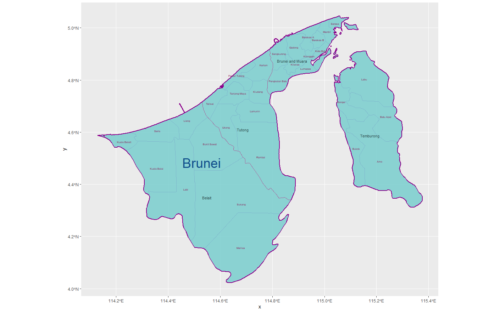
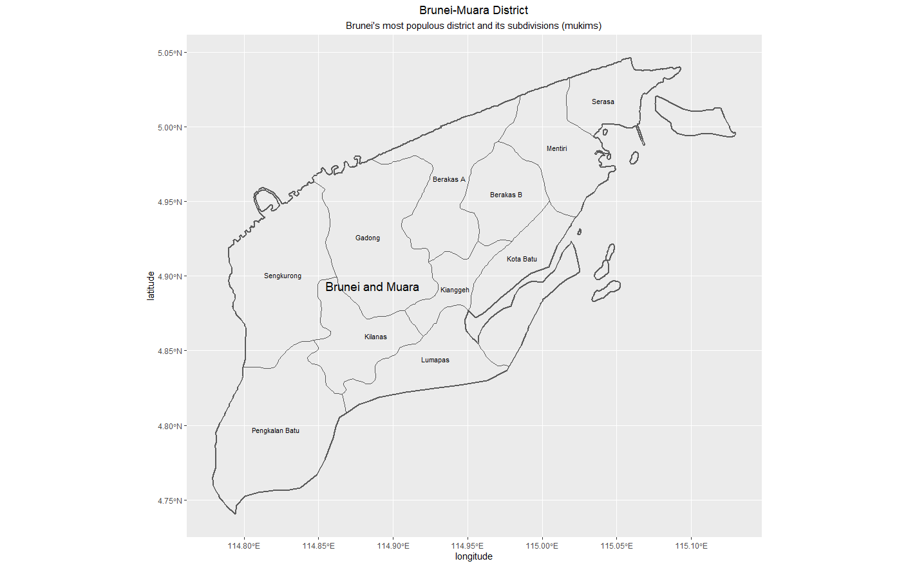

# Assignment 1: Plotting and Labelling Administrative Subdivisions 

For this assignment, I used shapefiles representing the small island country of Brunei to plot a map of the country's international borders, administrative boundaries, and county subdivisions. I utilized libraries, ggplot(), .shp files, and labelling tools to create my own map. 

## Stretch Goals

One of the stretch goals associated with this assignment involved isolating the most populous county of a country and plotting it. In Brunei, the most highly-populated county is Brunei & Muara, which has several smaller subdivisions contained within it. Mapping this county and its subdivisions with ggplot() created the image below. 

